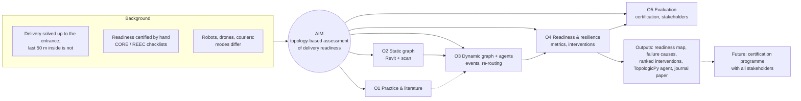

# Feedback Synthesis: Meeting with Prof. Jabi, 2026-10-05

> **Sources:** [transcript](jabi-feedback-10-05-2026-.txt) (the thesis-structure part of a group session) and [my notes](jabi-feedback-10-05-2026%20(notes).txt) (the one-to-one discussion of Research 2).
> **Written:** 2026-10-06

---

## 1. Outcome in one line

**Research 2 goes ahead and Research 1 is dropped.** Jabi called my aim "very spot on... pitched at the right level". Before the next meeting I need to write it in an academic voice, widen the horizon a little, and show that an agent can work.

## 2. What Jabi said, by theme

### A. How the thesis must be structured (transcript)

Jabi set the same structure for all three students:

1. **Background and motivation:** what the problem is and why it matters.
2. **One aim, in one sentence.** It sits "in the middle": general enough to guide the whole thesis, and specific enough not to be meaningless. Use the "five whys" to find that level. **The aim is never a tool. The tool is the means.** The aim should also **generalise** (could someone else, elsewhere, use it?).
3. **At most 4–5 objectives** that achieve the aim. They may be sequential or parallel, and they set the methodology.
4. **Research questions** that come out of each objective.
5. **Methodology:** a step-by-step guide covering everything I will do, including the prototype.
6. **Research framework:** one picture that combines background, aim, objectives and questions.
7. **Results:** only what happened, with no discussion.
8. **Discussion:** what the results mean.
9. **Conclusion:** the impact and significance for the state of the art.

His comment on my aim, *"to give owners a way to tell whether their building is actually ready for delivery robots to work within it, and if not, what they need to change"*: the right level, a problem many buildings will face, and new buildings will need requirements. **Action: rewrite it in an academic voice.**

### B. Widen the horizon (notes)

- **Delivery modes differ.** For example, delivery **through the window** (drones). "Keep your options open." Think about **Amazon**-scale operators.
- **Resilience** as a theme.
- "Expand the horizon of your thesis a bit." **Robots on graphs** in general, and a **list of topics**.

### C. Static and dynamic graphs (notes), the main new idea

> Buildings are static: the walls don't change. You will have **two sets of graphs**: a **static** one, and a **dynamic** one that shows **real-time events** and supports **dynamic route finding**.

This splits the "building brain" into two layers:

| Layer | Contains | Changes |
|---|---|---|
| **Static graph** | Spaces, doors, lifts, stairs and clearances, from Revit + scan | Only when the building is renovated |
| **Dynamic graph** | Congestion, residents, a lift out of service, a blocked door, fire or smoke | All the time, during a simulation |

The robotics literature we already hold has a direct match: Rosinol et al. (2020), *3D **Dynamic** Scene Graphs*.

### D. Prove that an agent can work (notes)

- *Context remark, not a requirement:* real robots follow route maps and use **LIDAR** to detect and avoid obstacles. This is background on how robots work today and belongs in the "how delivery is done today" research (O1). It is not a feature the thesis has to build.
- **Prove that an agent can work.** **Vibe-code** multi-agent movement in a building. The implementation in the virus paper (Jabi et al. 2025) was "quite primitive" and predates vibe coding.
- Jabi wants to **add an agent to the Topologic toolkit**. My agent implementation could become a **contribution to TopologicPy**.

### E. Starting point and related work (notes)

- **Paweł Boguslawski: fire evacuation in tall buildings** is *the* starting point. He started fires in parts of a building and simulated exit and evacuation routes with agents. (My notes spell it "Povel Pavalaski". Boguslawski fits: he works on navigable networks from **non-manifold** 3D models for emergency response. His 2016 *Automation in Construction* paper is already on our to-download list, and he co-wrote Díaz-Vilariño et al. 2016, which we hold.)
- **Other frameworks for turning NMT (non-manifold topology) into navigation models.** Survey alternatives to TopologicPy's approach. *(My reading of "NMT to manifold"; check with Jabi.)*
- An earlier thesis used **isovists** ("isofit" in my notes) to study how people move towards **landmarks** in urban areas: real-time and multimodal. *Ask Jabi for the reference.*
- **Follow up on the demo Jabi showed:** the **VIRIS web app** (Viral Infection Risk Indoor Simulator), from his viral-infection work. It is built on TopologicPy and runs agents on daily schedules. Code: [KaterinaKaouri/VIRIS](https://github.com/KaterinaKaouri/VIRIS). This is the concrete base the new agent should improve on.

### F. The ambition (notes)

- **A research journal paper** should be the ultimate goal.
- **The end goal is not just a tool but a certification programme** that involves all stakeholders (owners, designers, delivery operators, robot makers, residents).

## 3. What this changes in the proposal

| Topic | Proposal v3 / abstract | After feedback |
|---|---|---|
| Aim | Written as an outcome for owners, conversationally | **One academic sentence; the tool is the means** (draft below) |
| Building brain | One layered graph | **Static graph + dynamic graph**, with dynamic route finding |
| Agents | Follow Dijkstra paths with fixed abilities | Same principle; **re-route when the dynamic graph changes**. A better implementation than VIRIS, possibly as a TopologicPy agent |
| Delivery modes | Wheeled vs stair-climbing robot | **Several modes**: wheeled, stair-climbing, drone or window, human courier as baseline |
| Disruptions | Residents cause congestion | **Resilience**: lift outage, blocked route, fire or smoke (from Boguslawski) |
| Starting point | Jabi et al. (2025) | Jabi et al. (2025) **plus Boguslawski** (evacuation in tall buildings) |
| End goal | A readiness simulator | A journal paper, an agent for TopologicPy, and a method that could **underpin a certification** |

### The tension: wider horizon vs 3 months

Jabi asked for a wider horizon, but the time is fixed at 3 months. **My recommendation:** widen the **framework**, not the **evaluation**.

- The framework (aim, static/dynamic model, agent profiles) is written generally enough to cover any delivery mode and any disruption. That makes the aim generalisable, which is what Jabi asked for.
- The evaluation covers a **subset** on the real building: for example, wheeled robot vs stair-climber vs human baseline, under normal conditions vs a lift outage vs a blocked route. Window or drone delivery is shown as an **access point in the graph** (a window or balcony node), not as flight simulation.
- The **certification programme** is the long-term goal. The thesis contributes its **evidence base**: a simulation-based method that tests the kind of criteria Korea's CORE and REEC set by hand, which Park & Park (2026) call for. Setting up a stakeholder programme is future work and goes in the discussion.

## 4. Draft aim, objectives and research questions

**Aim (draft):**

> This thesis aims to develop and evaluate a topology-based method for assessing the readiness of buildings for autonomous indoor delivery, and for identifying the spatial interventions that would improve it.

It answers Jabi's five-whys test. It is not a tool, it generalises beyond one building and one robot, and it keeps "what they need to change".

| # | Objective | Research question(s) |
|---|---|---|
| O1 | **Establish the state of practice and research**: how delivery works inside residential buildings today (couriers, lockers, robots, window/drone), how readiness is certified, and how agent-based navigation and evacuation are modelled (Boguslawski, Jabi, scene graphs) | RQ1: What spatial and operational conditions determine whether an autonomous agent can complete an indoor delivery, and how are they assessed today? |
| O2 | **Build the static building graph** from the building's own data (Revit model + point cloud) with TopologicPy | RQ2: How much does enriching a model-based graph with as-built scan data change a readiness assessment? |
| O3 | **Model the dynamic layer and agents**: real-time events, residents, delivery agents with different abilities, and dynamic re-routing | RQ3: How do dynamic conditions (congestion, lift outage, blocked routes) affect delivery success, and how resilient is a building's network to them? |
| O4 | **Define and compute readiness and resilience metrics** by unit and level, and rank interventions by their effect | RQ4: Which interventions most improve readiness, and does a network-level assessment find failures that item-by-item checklists miss? |
| O5 | **Evaluate** against existing certification criteria (CORE/REEC) and with stakeholders (owners, operators) | RQ5: How well do simulated readiness results agree with certification criteria and with expert judgement? |

## 5. Research framework (first sketch)



## 6. Pipeline map (first sketch)

```
Revit model ──► extract (C# / Revit API) ──► TopologicPy NMT model ──► STATIC graph
Point cloud ──► clearances, obstructions ──────────────┘                 │
                                                                         ▼
Agent profiles (wheeled 550×600 mm, stair-climber, drone/window, human) ─► SIMULATION ◄── DYNAMIC graph
Delivery tasks ("Apt 7B, kitchen"), resident schedules ──────────────────┘          (events: congestion,
                                                                                     lift outage, fire)
                                                                         ▼
                        readiness map · failure causes · resilience · ranked interventions
```

## 7. What next

### This week (by ~2026-10-12)

1. **Prove an agent can work** (the top priority Jabi set). Vibe-code a minimal multi-agent simulation on a TopologicPy graph: two or three agents, a two-level toy building with a lift, Dijkstra routing, and **one dynamic event** (a door closes) that forces a re-route. Make it a notebook in `research-2/experiments/`. Install `topologicpy` first: it is not in the current Python environment.
2. **Rewrite the aim in an academic voice** (section 4) and settle the 4–5 objectives and their questions.
3. **Get Boguslawski's work.** Download Boguslawski et al. (2016) and search for his fire-evacuation and tall-building papers. Confirm the name with Jabi if they don't match.
4. **Run the VIRIS app and code** (the demo Jabi showed) and **check what TopologicPy can and cannot do** for agents: navigation graphs, `Graph` path methods, any existing agent or simulation code, and how the virus-paper simulation was built. That shows where an "agent" module would fit.

### Next two weeks

5. **How delivery is done in apartments today:** couriers, lockers and package rooms, Amazon Key (in-building access), robot pilots (Woowa, Naver, others), drone and window or balcony delivery, and how delivery robots navigate (route maps, LIDAR for obstacle avoidance) as background. One page, sourced.
6. **Framework of ideas** to investigate, plus the **wishlist of topics** Jabi asked for, under the "robots on graphs" horizon.
7. **Static vs dynamic graphs:** a short literature note (Rosinol 2020 dynamic scene graphs, Hydra, Boguslawski's variable-density networks, Jabi 2025).
8. **Other NMT → navigation frameworks:** IndoorGML, Boguslawski's dual half-edge, Díaz-Vilariño, Xu 2017.
9. **Draw the research framework** properly (from section 5) and **document the pipeline** (section 6).
10. **Proposal v4:** add the static/dynamic graphs, delivery modes, resilience, the aim and objectives, and the Jung/Park findings already planned. Archive v3 first.

### Questions and wishlist for the next meeting

- Is Boguslawski the right name, and which of his papers?
- The isovist/landmark thesis: who wrote it, and where is it?
- VIRIS: which parts does he consider primitive, and should the new agent extend VIRIS or be a fresh TopologicPy module?
- What would he want the TopologicPy agent to look like: API, scope, and whether it should be contributed upstream?
- "NMT to manifold": did I understand this correctly?
- Which journal is he aiming at? (This shapes the evaluation.)
- Is the evaluation subset in section 3 wide enough for him?
- Meeting rhythm and milestones over the 3 months.

## 8. Resources pooled for this feedback

Each resource is tied to the theme it serves. Files marked **held** are in [`_papers_/`](../_papers_/README.md).

### Starting point: agents, evacuation and dynamic routes (themes C, E)

| Resource | Why | Status |
|---|---|---|
| Boguslawski, Mahdjoubi, Zverovich & Fadli (2016). [*Automated construction of variable density navigable networks in a 3D indoor environment for emergency response*](https://www.researchgate.net/publication/308019221_Automated_construction_of_variable_density_navigable_networks_in_a_3D_indoor_environment_for_emergency_response). Automation in Construction 72, 115–128 | **Jabi's named starting point.** Navigable networks from non-manifold BIM models; walkways disrupted by fire, explosion or obstruction. This is the static/dynamic split in practice | To download |
| Boguslawski et al. (2015). [*BIM-GIS modelling in support of emergency response applications*](https://www.researchgate.net/publication/306146196_BIM-GIS_modelling_in_support_of_emergency_response_applications) | The 3D BIM-GIS model the 2016 network is built on | To download |
| Jabi, Xue, Woolley & Kaouri (2025). [*3D topological modeling and multi-agent movement simulation for viral infection risk analysis*](https://www.tandfonline.com/doi/full/10.1080/00038628.2025.2603534) | The "primitive" agent implementation to improve on | **Held**, read |
| Xue, Jabi, Woolley & Kaouri (2024). [*Modelling indoor airborne transmission combining architectural design and people movement using the VIRIS simulator and web app*](https://www.nature.com/articles/s41598-024-79525-6). Scientific Reports. Preprint: [arXiv:2408.11772](https://arxiv.org/abs/2408.11772) | **The app Jabi demoed.** Three steps: architectural design → people movement → transmission. Swap transmission for delivery readiness and the pipeline has the same shape | To download and read |
| [VIRIS code and app (GitHub)](https://github.com/KaterinaKaouri/VIRIS) | The agent and movement code to study, reuse or improve: the "primitive" baseline | **Clone and run** |
| Díaz-Vilariño, **Boguslawski** et al. (2016). *Indoor navigation from point clouds* | Obstacles from scans; Boguslawski is a co-author | **Held** |
| Rosinol et al. (2020). *3D Dynamic Scene Graphs* | The robotics version of the static + dynamic graph | **Held** |
| Hughes et al. (2022). *Hydra* | A layered graph updated in real time | **Held** |
| [*Emergency Response in Complex Buildings: Automated Selection of Safest and Balanced Routes*](https://www.sciencedirect.com/science/article/pii/S109396872600784X) (ScienceDirect, 2026) | Recent work on dynamic safest-route selection; authors not yet checked | To check |
| [*A new integrated agent-based framework for designing building emergency evacuation: a BIM approach*](https://www.sciencedirect.com/science/article/pii/S2212420923002339) (2023) | BIM-to-agent evacuation pipeline: a comparable framework | To check |

### TopologicPy: what it can and cannot do (theme D)

| Resource | Why |
|---|---|
| [TopologicPy on GitHub](https://github.com/wassimj/topologicpy) | Source code. Check the `Graph` navigation methods and look for any agent or simulation code |
| [*TGraph gives TopologicPy a more explicit graph layer*](https://osarch.org/2026/06/22/topologicpy-tgraph/) (OSArch, June 2026) | A new graph layer. It may decide where a static/dynamic graph and an agent module fit |
| Jabi (2025). [*TopologicPy: A Syntopic Integration of Geometry, Topology, and Semantics*](https://link.springer.com/chapter/10.1007/978-3-032-02782-5_1) | The core method reference |

### Other NMT → navigation frameworks (theme E)

| Resource | Why | Status |
|---|---|---|
| Afyouni et al. (2012). *Spatial models for indoor navigation: a survey* | A map of the alternatives | **Held** |
| Xu et al. (2017). *BIM-based indoor path planning considering obstacles* | A BIM-based baseline | **Held** |
| OGC IndoorGML | The standard for indoor navigation networks (a dual of the space model) | To find |
| Armeni et al. (2019). *3D Scene Graph* | Building → room → object hierarchy | **Held** |

### Isovists, landmarks and wayfinding agents (theme E)

| Resource | Why | Status |
|---|---|---|
| The thesis Jabi mentioned | Isovists and landmarks, real-time, multimodal | **Ask Jabi for the reference** |
| Raubal (2001). [*Agent-based simulation of human wayfinding*](https://www.raubal.ethz.ch/Publications/Theses/mr_phD.pdf) (PhD, ETH) | Background on agent-based wayfinding (optional) | To skim |
| Yesiltepe et al. (2021). [*Landmarks in wayfinding: a review*](https://link.springer.com/article/10.1007/s10339-021-01012-x) | Background on landmarks | To skim |

### Readiness, certification and delivery practice (themes B, F)

| Resource | Why | Status |
|---|---|---|
| Jung et al. (2023). CORE for apartment complexes | Checklist to compare against; standard robot of 550 × 600 mm | **Held**, read |
| Park & Park (2026). Robot-adaptive design standards | Calls for robot-navigation simulation; the certification angle | **Held**, read |
| Urban Freight Lab (2018). *The Final 50 Feet* | Time spent inside buildings | Linked, to read |
| NMHC (2018). Package delivery survey | Parcel volumes in apartments | Linked, to read |
| How delivery works in apartments today (Amazon Key, lockers, Woowa/Naver robots, drone or window delivery) | Jabi's "look how it's done today" | **To research** (next step 5) |

## 9. Open from before (still blocking)

- **The data:** is the scanned and verified building multi-storey residential? Scan format? Is the scan registered to the model? This still decides the case study.
